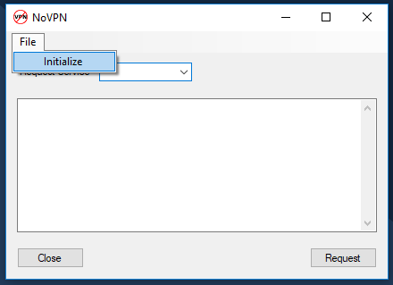
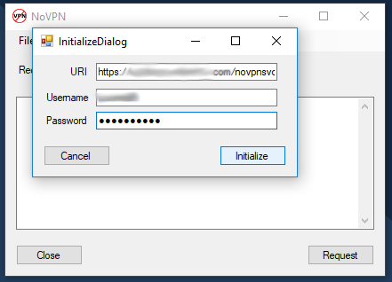
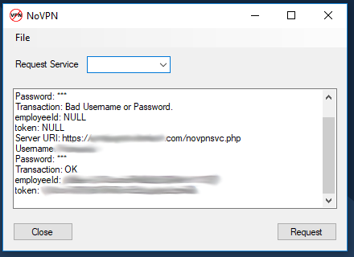
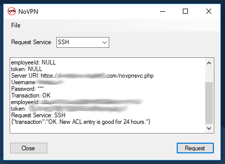

# NoVPN Client
The first time you start the NoVPN Client, you'll need to initialize it.  What
this is actually doing is authenticating with the server and generating a token
that will be used communicate with the server application for service requests.
 
Click File->Initialize
 

 
 
Enter the path to the NoVPN server application, your username, and password.
If you enter a bad username or password, the server will let you know.  If you
enter a bad username and password three times, your IP address will be
blacklisted and the server will stop responding.
 

 
 
If all goes well, you'll see your user ID and token key returned from the
server.
 

 
 
You only need to initialize once.  Now that you've done that, your ID and token
will be stored on your local machine for future use.  You can go ahead and make
a request to open up a service port on the firewall now.
 
